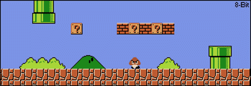

### 👋 G'day Mate, I’m Kelsi (@Xinqwq)  
 <picture>
   <source media="(prefers-color-scheme: dark)" srcset="https://imgur.com/t3YXlZE" />
   <source media="(prefers-color-scheme: light)" srcset="https://imgur.com/t3YXlZE" />
   
 </picture>

- 👀 Interested in algorithms, data structures, and game strategy (especially fs games & board game Avalon).  
- 🌱 Currently focusing on LeetCode to strengthen my problem-solving skills.  
- 🎓 Graduate student preparing for job applications.  
- 💡 Exploring forward-thinking and emotional resilience.  
- 📫 Reach me via GitHub or other platforms.  
- ⚡ Fun fact: I enjoy deep discussions on psychology and decision-making!

## Skills

<!---->

## Contact
📩 Reach me [here](https://xeinacc.cn)

## Stats 

<picture>
  <source media="(prefers-color-scheme: dark)" srcset="https://raw.githubusercontent.com/Xinqwq/Xinqwq/output/github-contribution-grid-snake-dark.svg">
  <source media="(prefers-color-scheme: light)" srcset="https://raw.githubusercontent.com/Xinqwq/Xinqwq/output/github-contribution-grid-snake.svg">
  
</picture>

  

  

<!-- ## Star History

<a href="https://www.star-history.com/#azl397985856/leetcode&Date">

 <picture>
   <source media="(prefers-color-scheme: dark)" srcset="https://api.star-history.com/svg?repos=azl397985856/leetcode&type=Date&theme=dark" />
   <source media="(prefers-color-scheme: light)" srcset="https://api.star-history.com/svg?repos=azl397985856/leetcode&type=Date" />
   
 </picture>
</a>
-->
